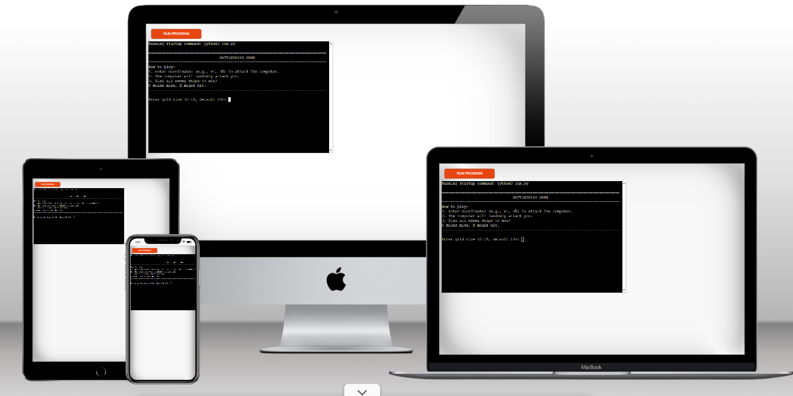
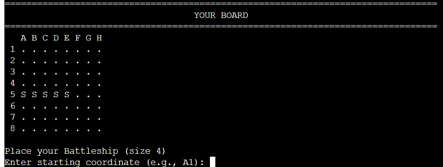
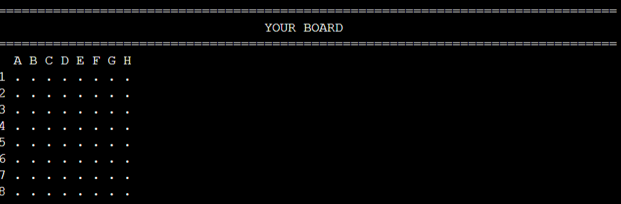
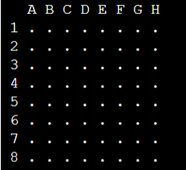
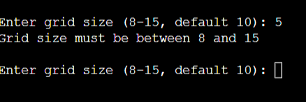
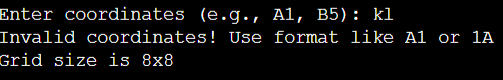
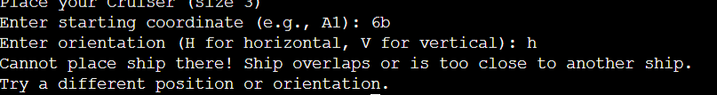
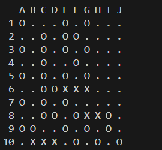

# Battleship game

Welcome to the battleship game, a game runs on the Python terminal.

user will be up against enemy AI, both player and computer will have 5 ships with their own initial and user must destroy all of opponent ships before all of their own ships sunk.

Here is my project mock up test result.

[Link to deployed site](https://battleship-python-project-onrender-com.onrender.com/)

## How to play

Battleship game based on the project suggestion by code institute.

In this version, user need to input their username first.

Afterward, player should input their ships coordinate, those are:

Battleship, Frigate, Cruiser, Aircraft carrier, and (Sub)marine.

The player will be able to see their ships placement after input valid coodinates.

They will be market with their initial and color:

- Battleship

- Cruiser

- Destroyer

- Submarine

- Aircraft Carrier

After input the coordinate for each ships, player will be able to input coordinate to where they would like to fire a shot.

If player missed it will display " O ", while if it was a hit it will be shown by X.

While the computer coordinates will be randomize and the player must guess where the ships are.

Player and computer will be take turn to discover the ship location.

In order to win the game either player or computer must sunk all 5 ships.

# Features

## Existing feature

- Customize board

    - Player allowed to choose where do they want to put their board.

    - Different initial for different ships.

    - Allowing player to choose the size of the board.

- Computer board

    - Computer board will generate random.

    - Computer board will only shows the ship that been hit.

- Input valdation error:

    - User need to enter the row and col from 0 to 9

    - User need to pick a valid coordinate

    
    - Ships overlap message.

    - X means hit and O means missed.

# Future feature

- Adding colour to the ship.

# Data Model

The based model is from the battleship game with bigger map. Similar system which shows the player board while the empty board belong to the computer.

The board model also make it easier to keep track of the situation combining with create_battlefield and display_battlefield function. 

# Testing

I have used couple of methods to check the game function:

    - passed the code PEP8, no error occur.
    - Invalid input will be respond with asking for valid numbers or that has not been picked.
    - Testing through heroku result is no error occur.

# Bugs

## Solved bug

- When input number 8 it automaticly change to 10x10 size.

## Remaining bug

- No bugs remaining.

# Validator test

- PEP 8

    - No error result

# Technology used

- Python

- Heroku

- Visual code studio

# Deployment
This project was deployed through render:

- Create Render Account

- Click New

- Click "Web Service"

- Search for repo and click connect

- Name the app

- Ensure root empty

- Enviornment Python 3

- Region Frankfurt Central Europe

- Branch have to be Main

- Set build in command  pip install -r requirements.txt && npm install

- start command node.js

- Ensure free plan

- Scroll to advance

- Click Add enviornment variable
    Port = 8000
    Python_version = 3.10.7

- Click Deploy

This project was deployed through heroku:

Follow the step below:

- Create heroku app

- Add name for the app

- Choose either Europe or United State

- Go to setting

- Set the buildbacks first to Python and afterward NodeJS

- Add The key is PORT and the value is 8000 to the Config Vars

- Connect to GitHub and then search for the project by the name

- Click Deploy

# Credit

Code institute suggestion for Project.

I would like to thank you my mentor Brian Macharia.

Deployment method on Render

- https://code-institute-students.github.io/deployment-docs/15-pp3-deploy/